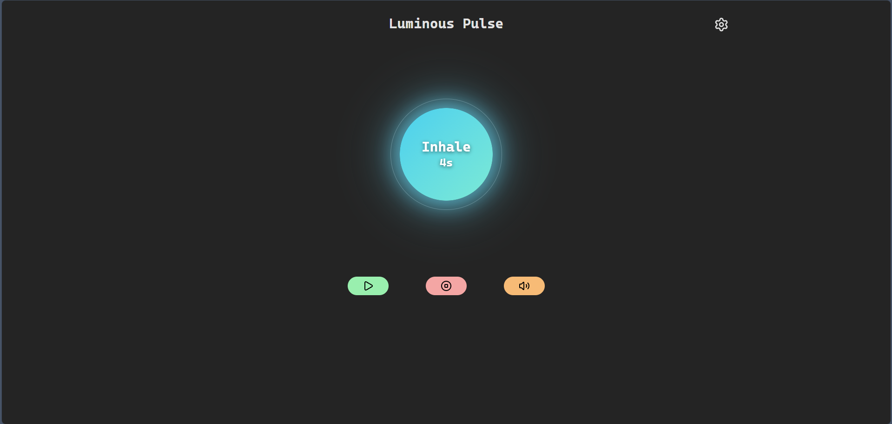
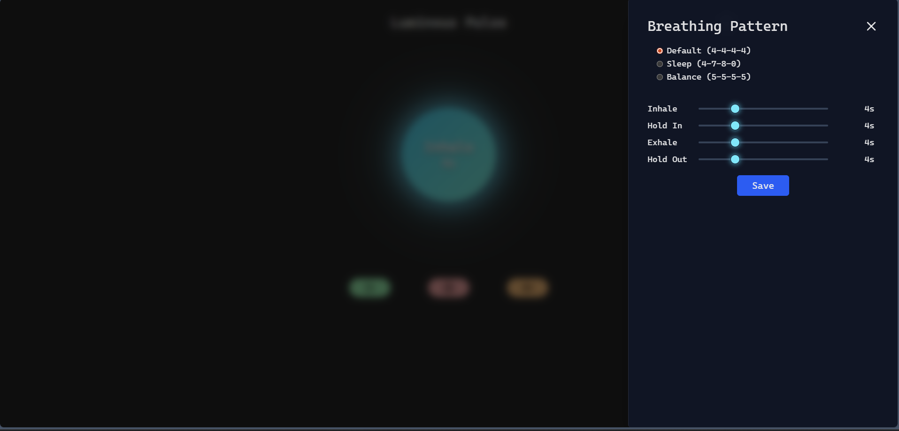

# 🌌 Luminous Breath

A cyber-aesthetic breathing companion designed to help you focus, relax, and sleep using the **4-7-8** and **Box Breathing** techniques. Built with a focus on immersive audio-visual synchronization.

[**🔴 Live Demo**](https://sivakrishna6745.github.io/Luminous-Pulse/)

#### Home Page



#### Settings Modal



## ✨ Features

-   **🧘‍♂️ Audio-Visual Synchronization:** A custom "Pulsar" visualizer that expands and glows in perfect sync with your breath.
-   **🔊 Real-Time Audio Synthesis:** No MP3 files. Uses the **Web Audio API** with dual detuned oscillators to generate organic, binaural-beat-style drones in real-time.
-   **⚡ Cyberpunk Aesthetic:** Glassmorphism UI, neon-glow sliders, and reactive lighting effects.
-   **🧠 Smart Presets:** One-tap configurations for popular techniques:
    -   **Relax (4-7-8):** For sleep and anxiety reduction.
    -   **Box Breathing (4-4-4-4):** For focus and stress management.
    -   **Balance (5-5-5-5):** For coherence and HRV training.
-   **🔋 Wake Lock API:** Prevents your phone screen from turning off during a session.

## 🛠️ Tech Stack

-   **Frontend:** React, TypeScript, Vite
-   **Styling:** Tailwind CSS (Custom animations & Glassmorphism)
-   **State Management:** React Hooks (Custom `useAudioEngine`, `useBreathingEngine`)
-   **Audio:** Web Audio API (Oscillators, Gain Nodes)

## 🚀 Getting Started

If you want to run this locally or contribute:

1.  **Clone the repository**

    ```bash
    git clone [https://github.com/](https://github.com/)<your-username>/<repo-name>.git
    cd <repo-name>
    ```

2.  **Install dependencies**

    ```bash
    npm install
    ```

3.  **Run the development server**

    ```bash
    npm run dev
    ```

4.  **Build for production**
    ```bash
    npm run build
    ```

## 🎮 How to Use

1.  **Select a Pattern:** Open settings and choose a preset (Sleep, Focus, Balance) or customize the sliders manually.
2.  **Turn up Volume:** The audio engine generates calming low-frequency tones.
3.  **Sync your Breath:**
    -   **Inhale** as the circle expands and glows bright.
    -   **Hold** as the circle stays steady.
    -   **Exhale** as the circle shrinks and dims.

## 📄 License

This project is open source and available under the [MIT License](LICENSE).
